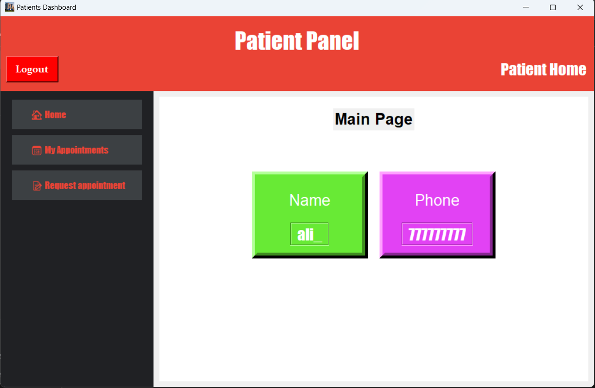
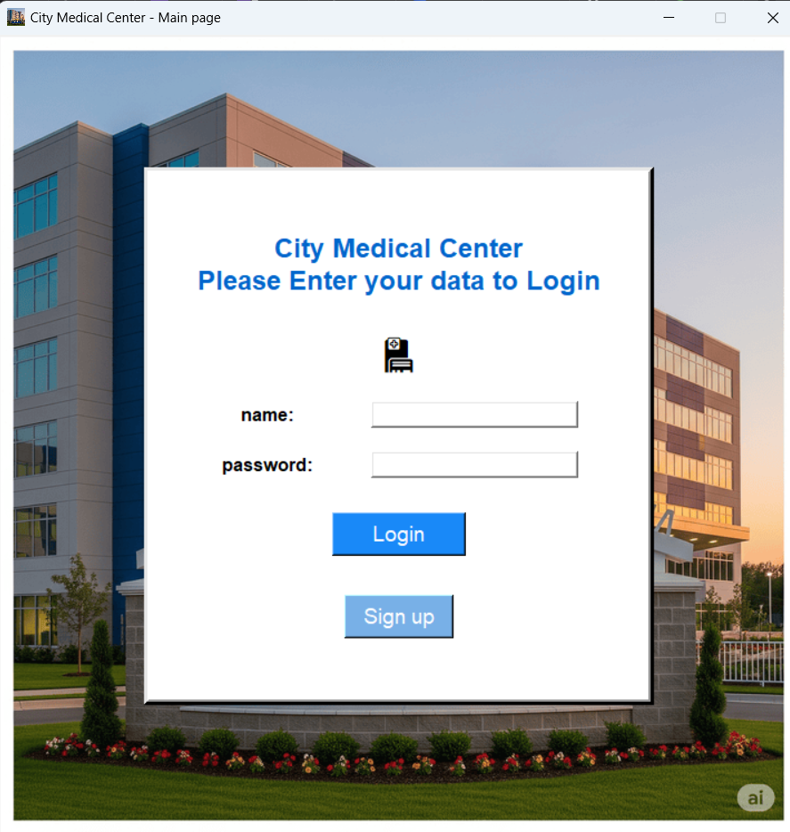
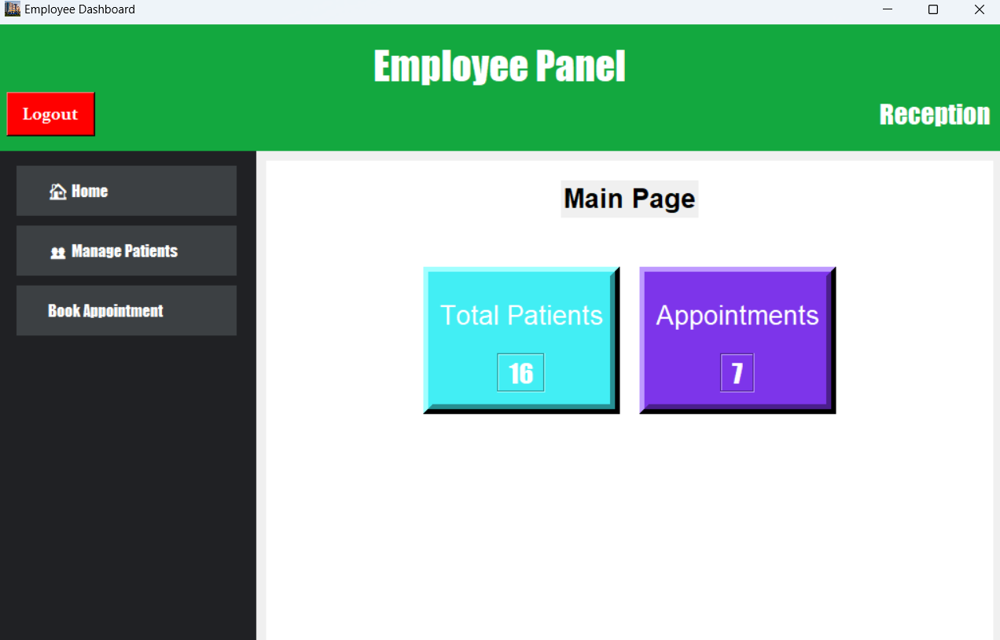
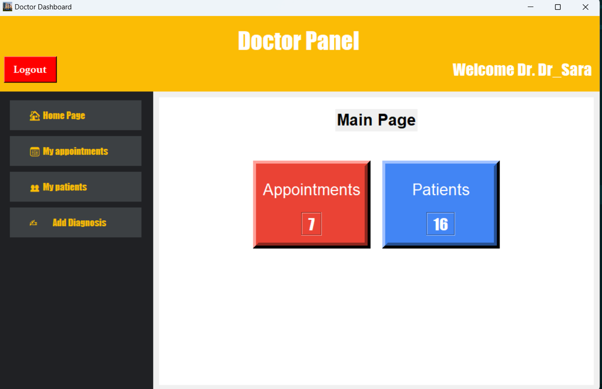

# 🏥 Hospital Management System: A Python Tkinter Dashboard 🚀

| Status | Language | GUI Framework | Author |
| :--- | :--- | :--- | :--- |
| *Development* | Python 3.x | Tkinter | [Basem0AlHersh123](https://github.com/Basem0AlHersh123) |

This is a **Python-based Hospital/Admin Management System** implemented using the standard **Tkinter** library for the Graphical User Interface (GUI). It provides a multi-functional dashboard for administrative staff to manage core hospital resources and personnel.

-----

## ✨ Features

  * *Centralized Dashboard:* A main administrative page displaying key statistics like **Patients**, **Doctors**, **Appointments**, and **Funds**.
  * *Modular Management:* Dedicated dashboards for managing user types, including:
    * 😷 **Doctors** dashboard
    * 👥 **Patients** dashboard
    * 💼 **Employees** dashboard
  * *Utility Tools:* Includes a sidebar link for quick access to a **🧮 Calculator**.
  * *Reporting:* A dedicated section for viewing **📊 Reports** and generating data summaries.
  * *Data Persistence:* Utilizes a custom `FileManager` to store and retrieve application data (found in the `data` directory).

-----

## 🛠 Technologies Used

  * *Python 3.x*
  * *Tkinter* (Standard Python GUI library)
  * *File I/O* (Used for data handling and storage)

-----

## 💻 Installation & Usage

This project is a standalone Python application that requires no complex web server setup.

1.  *Clone the repository:*
    ```bash
    git clone [https://github.com/Basem0AlHersh123/Python-Hospital-Management-System.git](https://github.com/Basem0AlHersh123/Python-Hospital-Management-System.git)
    ```
    
2.  *Navigate to the project directory:*
    ```bash
    cd Python-Hospital-Management-System
    ```
    
3.  *Install Dependencies:*
    Ensure you have all necessary Python libraries installed.
    ```bash
    pip install -r requirements/requirements.txt
    ```
    
4.  *Run the Application:*
    Execute the main application file (you may need to adjust the filename if it's not `main.py`).
    ```bash
    python main.py 
    ```

-----

## 📂 Project Structure

This structure shows where the Python code, data, and configuration files are located:
├───background/ # Backend logic and utility classes (e.g., file_manager.py) │   └───__pycache__/ ├───data/ # Storage location for application data (user records, etc.) ├───GUI/ # All Tkinter UI code (e.g., dashboard modules, calculator) │   └───__pycache__/ └───requirements/ # Contains requirements.txt for project dependencies

## 📸 Screenshots

| admin    | patients    | Login     | employees |   doctors |
|----------|-------------|-----------|-----------|-----------|
|  |  |  |  | 
-----
-----


📢📢📢📢You need to know the usrnames and passwords used. You can do that by checking data folder.


## ✍ Author

  * *Basem Al-Hersh* - Initial Work
      * *GitHub Profile:* [https://github.com/Basem0AlHersh123](https://github.com/Basem0AlHersh123)
